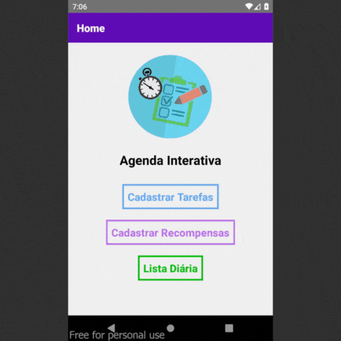

# React_Native_Agenda_Interativa

Repositório para ao versionamento do App "Agenda Interativa" destinado à organização de tarefas diárias.

## Descrição
Esse App foi feito como um Projeto pessoal para a aplicação dos conhecimentos de desenvolvimento 
mobile do curso Técnico em Informática para a Internet.
O App "Agenda Interativa" é basicamente uma aplicação para organização de tarefas diárias, 
nela o usuário pode cadastrar as tarefas que tem pra realizar durante o dia, e também pode cadastrar
suas "Recompensas" diárias, que virão após o término das tarefas, assim fica mais fácil organizar os
afazeres de cada dia, sem deixar de lado um merecido descanso.

## Instalação
1. Baixe o arquivo .zip do Projeto.
2. Extraia o projeto e abra no seu editor de código-fonte.
3. Execute no terminal o comando `npm install` para a instalação de todos os pacotes do projeto.
4. Rode o projeto e confira.

## Uso
No App Agenda Interativa você pode marcar como concluidas as tarefas já terminadas e acompanhar
seu progresso diário.

